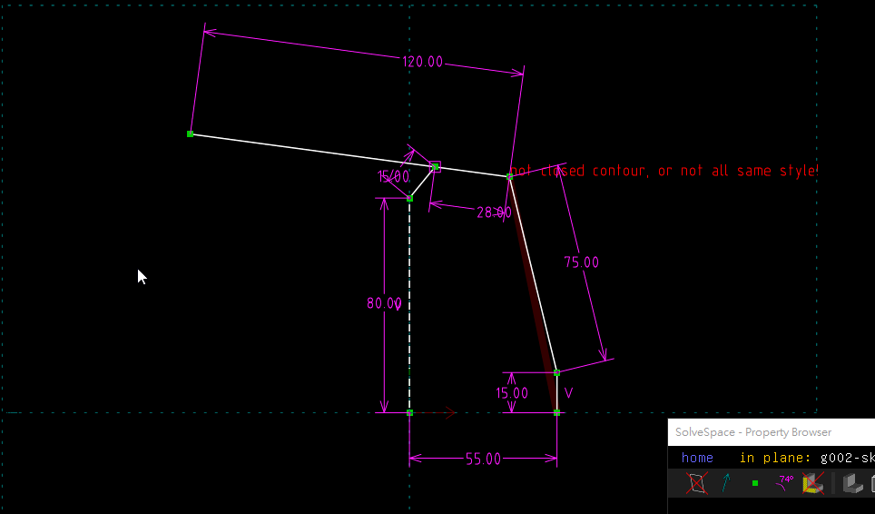

Title:2017 Fall CADP 第十三週
Date: 2017-12-08 13:30
Category: Course
Tags: 2017fall, CADP
Slug: 2017-fall-cadp-w13
Author: 40423224

第十三周心得

<!-- PELICAN_END_SUMMARY -->

討論并完成鋼球運動機構的循環機構

</img>

運用此機構將鋼球從高到低循環

下面是onshape的绘制:

<iframe src="./../data/stlviewer/viewstl.html?src=./../finalexam/001.stl" width="800" height="600"></iframe>
